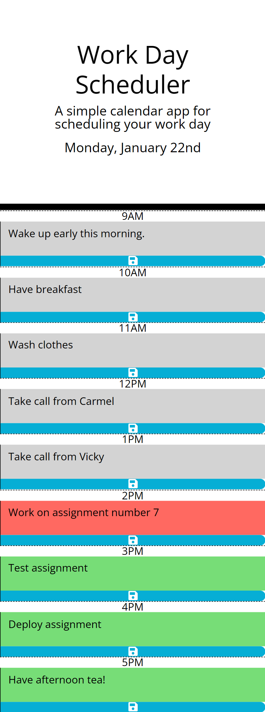

# third-party-api-work-day-scheduler
Challenge 7 of edX Boot Camp (Front End) to create a simple calendar application.

## Description

For Weekly Challenge 7 of the edX Bootcamp Front End Course, I was given a task of writing code to create a simple calendar
application that allows a user to save events for each hour of the day. The app will run in the browser and feature
dynamically updated HTML and CSS powered by jQuery.

> What was my motivation?

My motivation was to accelerate my front end skills in web development so I can successsfully secure a web development job. 
I am building on my skills and each week I'm growing from strength to strength and want to achieve top grades throughout 
all the exercises.

>Why I built this project?

Building the website helped me to bridge the gap between theoretical knowledge and practical of applying
my Javascript, jQuery and Day.js library knowledge that I learnt in Week 7.

> What problem did it solve?

It solved the problem of documenting important events so time can be managed more effectively.

> What did I learn?

I learnt how to use Javascript and jQuery to write code that is clean, readable, with comments and is maintainable.  I also ensured that I included material that I learnt in Week 7 (Third-Party APIs). I also applied the use of day.js library for date handling.

> What makes my project stand out? 

It stands out as I have successfully completed the exercise, used good programming practice in terms of writing clean code.
I have used appropriate constants and variables that are understandable. Also, I used prefix of $ to the name of variables
that contains jQuery objects in order to help differentiate. There are comments throughout the code so it can be understood by any developer.  

The business hour times are stored in an array and based on that array, time blocks are created dynamically.
So in the future, if more times needed to be added then you just only update the array! Please note for this exercise,
I have hardly updated the html file, majority of code has been written in the Javascript files.

The project has been structured so that it is loosely coupled, there is a separation of concern so days_funcs.js
holds all the logic for handling date handling and also calls functions from day.js library.

The current day displayed exactly like the animated gif as it includes the suffix of 'st', 'nd', 'rd', 'th' to the day (eg. 22nd).

I implemented logic so that the Save button just saves for that hour.

When the user clicks on the 'Save' icon, it changes to black colour icon for less than a second and then reverts back to white colour icon.

Every 5 minutes, I check to see if the hour has changed and if so then I run the function to update the colours of the timeblocks.
Also, I check to see if the day has changed and if so then the local storage is reset with a blank structure ready for new data to be
added.

Lastly, I even created a favi icon as well !

I have pushed myself continually ensuring my work is of the highest quality. The code is readable and maintainable. 

> Technologies Used

* HTML
* Javascript
* jQuery
* Day.js Library

> Tools Used

* Microsoft Windows 11
* Visual Studio Code
* Git and GitBash
* Git Lab
* Git Hub
* Slack
* Google Chrome Browser
* Notepad
* Windows File Explorer
* Microsoft Paint

## Installation

The GitHub repository for my Third-Party APIs: Work Day Scheduler can be found at: https://github.com/timsbootcamp/third-party-api-work-day-scheduler

The source code can be cloned from the above link. 

## Usage

Link to my GitHub Repository: https://github.com/timsbootcamp/third-party-api-work-day-scheduler

Link to deployed site of my solution to Week 7 :Third-Party APIs: Work Day Scheduler : https://timsbootcamp.github.io/third-party-api-work-day-scheduler/

## Credits

jQuery API Documentation 
https://api.jquery.com/

jQuery Tutorial
https://www.w3schools.com/jquery/default.asp

